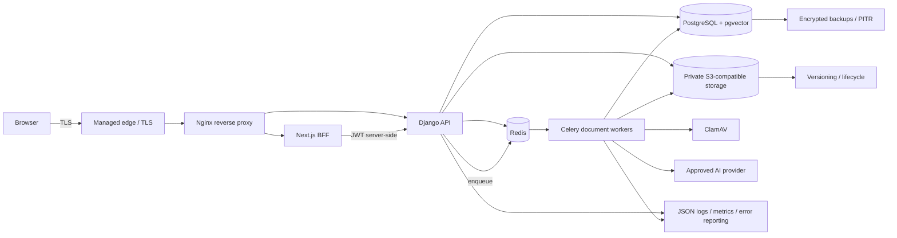

# Production architecture

The edge, proxy, Next.js, API, and workers are stateless and independently scalable. PostgreSQL, object storage, Redis persistence (operational only), backups, and scanner signatures are stateful. Only the edge/proxy is public. The API may be reachable from the proxy and BFF network; PostgreSQL, Redis, storage administration, workers, scanner, and metrics are private.

## Flows and boundaries

- Authentication: the browser posts to the Next.js BFF; the BFF stores access and rotating refresh tokens in Secure, HttpOnly, SameSite=Lax cookies. It sends the access token to Django and revokes the refresh token on logout. Browser JavaScript never reads either token.
- Upload: browser → BFF/API → authorised Django upload → private randomised storage key → `pending` scan → Celery scan queue → clean files enter extraction/chunking/embedding. Infected/suspicious files are quarantined and never extracted. Server-mediated upload is retained because it centralises size, ownership, checksum, and scan-state validation; direct S3 upload can be added later with one-time scoped credentials and completion verification.
- Async processing: Redis brokers a task. A versioned Redis lock prevents concurrent processing; database row locks and version checks protect commits. Tasks are late-acknowledged, bounded, retried with jitter, and routed to `documents`.
- RAG: Django computes a query embedding, applies owner/course filters before pgvector cosine HNSW search, builds bounded context, calls the configured provider, persists citations, and returns only authorised source metadata.
- Static assets are immutable application assets served via WhiteNoise or the proxy. Private uploaded documents are never static/public media and are accessed server-side or by short-lived signed URLs.

## Secrets and trust

TLS must terminate at an approved edge using a publicly trusted certificate. Django trusts forwarded HTTPS only from the private proxy network. Secret-manager boundaries contain Django/JWT secret, database/Redis URLs, storage keys, SMTP password, AI keys, monitoring DSN, and metrics token. No secret is a build argument or `NEXT_PUBLIC_*` variable. Enable HSTS preload only after every current and future subdomain is permanently HTTPS and the domain owner accepts preload’s long-lived consequences.

## Failure and scaling scenarios

- Database loss makes readiness fail; stop writes, restore PITR, then validate migrations and authorization. API and workers scale only after connection-pool budgets are checked.
- Redis loss pauses new async work and locks. Uploaded data remains in storage/DB; restore Redis, inspect duplicates, and resume workers. Redis is not the system of record.
- Storage/scanner failure keeps documents unprocessed; never bypass scanning. AI failure returns a controlled 502/503 and does not expose prompts.
- A worker crash releases its bounded lock by expiry; idempotency/version checks allow retry. Queue depth drives worker autoscaling.
- HNSW (`m=16`, `ef_construction=64`, cosine) was chosen for good recall and no IVFFlat training step at the initial unknown dataset size. It costs more RAM and insert work. Tune query `hnsw.ef_search` against recall/latency, raise build parameters for larger corpora, and `REINDEX CONCURRENTLY` after material bloat. A model dimension change requires a new vector column/index, dual writes/backfill, cutover, then cleanup—never alter the indexed dimension in place.

No scanner guarantees complete detection, and this architecture is not a compliance certification.
